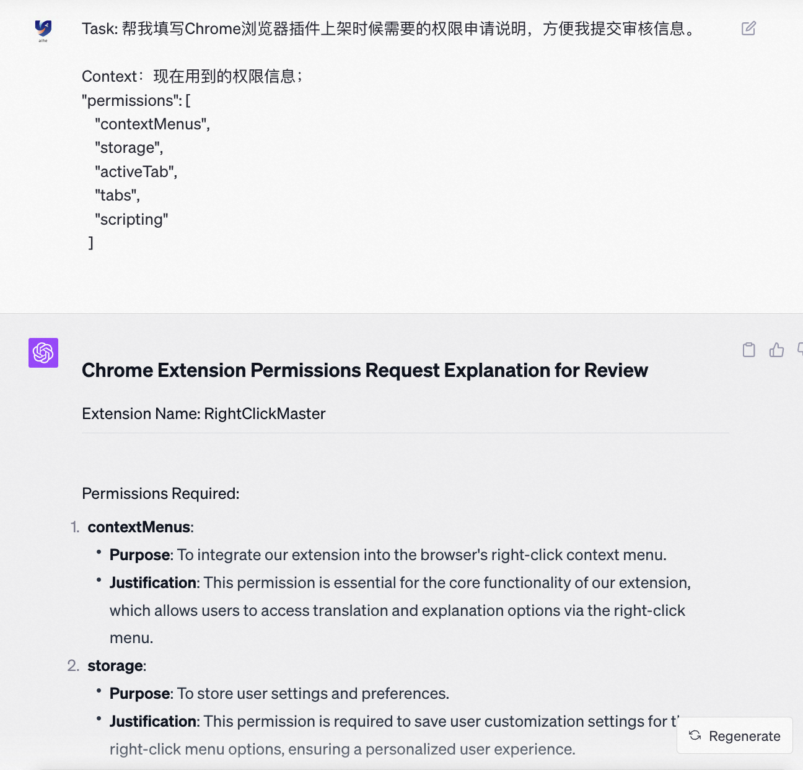

- [引言](#引言)
- [一个提示词公式](#一个提示词公式)
- [用GPT学习插件开发概念](#用gpt学习插件开发概念)
    - [1. 列出关键知识](#1-列出关键知识)
    - [2. 展开子知识并给出案例](#2-展开子知识并给出案例)
    - [3. 给出这个领域的最小MVP](#3-给出这个领域的最小mvp)
    - [4. 处理遇到的问题](#4-处理遇到的问题)
- [PRD写作大师：用GPT写产品需求](#prd写作大师用gpt写产品需求)
- [代码生成器：让GPT为你写代码](#代码生成器让gpt为你写代码)
    - [1. 开始编写](#1-开始编写)
    - [2. 继续编写](#2-继续编写)
    - [3. 交互式编写](#3-交互式编写)
    - [4. 修改和优化代码](#4-修改和优化代码)
    - [5. 处理问题](#5-处理问题)
- [文案生成器：用GPT来生成名称和宣传文案](#文案生成器用gpt来生成名称和宣传文案)
    - [1. 生成插件名称](#1-生成插件名称)
    - [2. 写宣传文案](#2-写宣传文案)
    - [3. 生成Logo样式](#3-生成logo样式)
- [上架准备：用GPT来准备需要的材料](#上架准备用gpt来准备需要的材料)
    - [1. 上架清单](#1-上架清单)
    - [2. 生成表单内容](#2-生成表单内容)
    - [3. 上架被驳回](#3-上架被驳回)
- [最后](#最后)
- [参考](#参考)

## 引言


随着AI技术的飞速发展，基于AI的产品和工具层出不穷。前段时间在使用一个叫Monica的工具，虽然它有很多有意思的功能，不过使用下来我发现我对它的需求就是`术语解释`功能。不同于翻译，单纯的翻译只是从一个不懂的词换成了另外一个不懂的词，术语解释就是要对词汇或者内容做一些更深的解释和背后的含义说明有助于你理解阅读的各种内容。


然后就是使用Monica的问题：

- 不能用GPT4，或者使用说使用GPT4有很多限制，等同于不能用
- 收费，每个月要9.9美元，但是我自己已经是GPT的会员了，感觉不需要重复花钱啊。


既然我只对术语解释有需求，最近又在学习AI这块，为什么不尝试用AI来解决这个问题呢？

然后决定动手开发一个具有类似功能的满足我诉求的浏览器插件，其实一个小时不到就能解决我的问题了；

想到自己是开发，感觉好东西要分享一下，又继续优化和完善了一下，做成一个通用性更强的插件，可以让更多的同学使用这个插件。

感觉既然都做了，干脆做到底吧，又去做了插件商店上架的一些适配，最终上架了，大家可以直接在插件商店下载并使用这个插件


插件地址：[QuickContext](https://chrome.google.com/webstore/detail/quickcontext-—-right-clic/iggjefleekfkknoabjfkaokakfbgjafg/related)


当然并不是来分享插件的，主要还是想分享下如何利用GPT来解决问题：

- 用GPT来学习新的技术或概念
- 用GPT写PRD、写代码、优化代码
- 用GPT起名、宣传、写创意
- 用GPT整理清单，帮助上架


可以做的事情还有很多，这里希望能抛砖引玉，和大家分享交流一下，AI和GPT不是高大上的概念或者只是聊天工具，它们还可以在我们的日常生活中中发挥巨大的作用。希望能对大家有所帮助。


## 一个提示词公式

如图我们进行思考，好的思维框架可以让我们更全面的思考问题，提升思考的质量。GPT也有许多Prompt的框架，好的Prompt可以提升GPT内容输出的质量，输出更加令人满意的内容。


有很多框架，这里分享下我再做插件的时候主要在用的一个框架，是一个科技博主分享的GPT公式，我觉得这个更容易理解和使用。


一个好的Prompt主要有以下几个部分组成：

1. **任务（Task）**: 始终以动词开始任务句子（如“生成”，“给予”，“写作”等），明确表达你的最终目标。
2. **上下文（Context）**: 提供用户背景、成功标准和所处环境等信息。
3. **示例（Exemplars）**: 提供具体的例子或框架，以改善输出质量。使用示例或框架可以大大提高输出质量。当然有时候我们可能没有示例，这个时候可以考虑让GPT帮忙生成示例。当然也有很多时候我们不用给示例。
4. **角色（Persona）**: 指定你希望ChatGPT和Bard扮演的角色。可以是具体的人，也可以是虚构的角色。
5. **格式（Format）**: 可视化你希望输出看起来的样子，表格、列表、段落等。
6. **语气（Tone）**: 指定输出的语气，如正式、非正式、幽默等。


有些是必须的比如Task，有些可以不是必须，但是有的话会更好，可以让GPT输出更准确的内容。

这六个构建块重要性顺序，任务是强制需要的，可以在一个Prompt中给单个任务、也可以给出多个任务。

**任务 > 上下文 > 示例 > 角色 > 格式 > 语气。**


让GPT给我写个简单的案例：

```
任务（Task）: 根据我提供的Prompt框架，编写三个示例Prompt。

上下文（Context）: 我正在研究如何有效地构建Prompt。我已经了解了一个有用的Prompt框架，并希望通过实际应用来测试其有效性。因此，我需要你按照这个框架为我创建三个示例Prompt。

Prompt框架要点:

任务（Task）: 用动词开头，明确指出你希望实现的目标。
上下文（Context）: 描述用户的背景、目标和环境。
示例（Exemplars）: 如果可能，提供具体的例子或模板以提高输出质量。
角色（Persona）: 指定你希望ChatGPT或Bard扮演的角色，可以是真实或虚构的人物。
格式（Format）: 描述你希望输出的视觉布局，如表格、列表或段落。
语气（Tone）: 指定输出的语气，例如正式、非正式或幽默。

---

现在，请根据上述框架，为我创建三个不同的示例Prompt，以助于我更好地理解和应用这个框架。
```


```
任务（Task）: 生成一篇关于AI发展趋势的文章。
上下文（Context）: 你是一个科技博客的作者，需要写一篇关于AI发展趋势的文章，目标读者是对AI感兴趣但不一定有专业背景的人。
示例（Exemplars）: 文章应包括AI的定义、历史、当前应用和未来趋势等方面。
角色（Persona）: 科技博客作者。
格式（Format）: 文章，包括引言、正文和结论。
语气（Tone）: 专业但易懂。
```


只给出任务，GPT就会自由发挥，然后你提供更多的信息，它就会做一些调整。写Prompt的时候可以参考框架做一下查漏补缺。


```
Task：生成多个可选的段落标题。
Context：现在我正在写一篇Prompt的文章，其中有个章节是利用用GPT学习插件开发概念，但是我觉得这个段落的标题不是那么的吸引人，想要修改下这个段落的标题。

Example：可以参考这几个段落标题，帮我重新生成几个标题
- PRD写作大师：用GPT写产品需求
- 文案生成器：用GPT来生成名称和宣传文案
- 代码生成器：让GPT为你写代码

--- 

现在开始帮我生成，我的原标题是“利用用GPT学习插件开发概念”
```


## 用GPT学习插件开发概念

在没有GPT之前，学习一个东西要硬啃官方文档和找一些学习资料来看，现在有了GPT，可以省掉很多的功夫，直接让GPT帮我总结核心内容，给出我想看的内容，包括给Demo和调试。使用GPT：

1、了解有哪些核心知识点

2、对某个子知识点展开学习，通过案例学习。

3、给出一个完整的案例，麻雀虽小，五脏俱全。

4、如果出错了，把错误信息完整的给到GPT，让其排查错误。


### 1. 列出关键知识

```
任务：帮我列出要开发谷歌浏览器插件所需要的关键知识？ 列出开发插件所需要具备的最核心的知识和工具。

我是一位对浏览器插件开发毫无概念的小白，现在想开发一款浏览器插件，用于解决平时阅读网页时遇到一些不懂的单词，可以利用插件快速帮我解释下这个单词的含义。
```


### 2. 展开子知识并给出案例

```
能否详细解释一下关于Chrome Extension API的知识和工具？  列出它的关键内容，并且给出案例方便我进行学习理解；
```


### 3. 给出这个领域的最小MVP

```
任务：写一个谷歌浏览器插件开发的Demo，让我能再浏览器插件中运行和看到运行效果：
1、给出完整的代码
2、给出完整的配置步骤，如何让代码加载到浏览器中

如果不能一次性给完，可以分多次给出，要给出完整的代码和完整的步骤。
如果有不能确定的地方，或者有疑问的地方要立刻提出来进行澄清，让我进行确定，再继续进行编写；
```


### 4. 处理遇到的问题

```
任务：帮我修复下这个错误，给出完整的修复步骤，并给出最终的代码内容；

错误内容：
Uncaught (in promise) Error: Cannot access contents of url "chrome-extension://ieggjkddfnhnoeajjocppimokpoggkfc/options.html". Extension manifest must request permission to access this host.
    at service_worker.js:36:30
    at extensions::contextMenusHandlers:33:9


错误对应的代码：XXX
```


## PRD写作大师：用GPT写产品需求

如果直接开始进入代码开发，你可能对自己正在开发的功能想的还不够清楚，这个时候后面让GPT也会有点困惑。

与其说写PRD，倒不如说是明确我们的产品插件到底要做的是什么事情，确定我们要做的事情，后面在进行代码编写的时候我们要做的事情要反复的告知GPT，让它能按照我们的想法完成功能。

这种方式其实也被称作"生成知识提示(Generated Knowledge Prompting)"。因为你直接让GPT帮写代码，它可能会困惑，有了知识，它就能更准确的做事了。


写完PRD之后，我们把目标和功能需求部分复制出来，让GPT根据目标和功能写代码。

```
任务: 基于我的需求描述帮我写一篇完整的产品方案文档；

Context：要做一个谷歌浏览器的插件；希望具备的功能
1、在网页上可以点击右键弹出我们插件的功能，支持对选择的内容进行翻译、解释；
2、用户可以自己配置右键弹出那些内容。
3、在点击弹出的插件功能时，背后请求OpenAI的API接口，拿到对应的响应内容。

假如你现在是一位非常专业的产品经理，基于描述的内容写写一篇完整的产品方案文档。
```


## 代码生成器：让GPT为你写代码

这个是最核心的部分，当然也会涉及到多次的交互，GPT会输出大量的代码和文字，我是会在提示词之后加上两句：

- 如果不能一次性的给出，可以分多次进行给出，每次都要给出对应步骤的完整代码；
- 如果有不能确定的地方，或者有疑问的地方要立刻提出来进行澄清，让我进行确定，再继续进行代码编写。


然后就是让GPT开始编写，继续编写，解决它的疑问，修改和优化，解决问题。


### 1. 开始编写

```
Task: 基于产品功能描述帮我开发对应的浏览器插件。  

Context：
我是一位非专业的开发同学，对代码了解不多，你要尽可能的给出完整的内容和操作步骤。

产品功能描述：
目标
提供一个简单易用的界面，让用户可以通过右键菜单访问翻译和解释功能。
允许用户自定义右键菜单的选项。
利用OpenAI的API接口，提供准确和及时的翻译和解释。
功能需求
1. 右键菜单集成
用户在网页上选中文本后，右键点击会弹出包含“SmartTranslate”选项的菜单。
2. 翻译与解释
用户点击“SmartTranslate”后，将看到一个子菜单，其中包括“翻译”和“解释”两个选项。
3. 用户自定义
用户可以通过插件设置界面自定义右键菜单的选项，例如只显示“翻译”或“解释”。
4. OpenAI API集成
所有的翻译和解释请求都将通过OpenAI的API进行，以确保准确性和及时性。


角色： 你是一位专业的浏览器插件开发工程师，拥有多年丰富的开发经验。

现在基于产品描述的内容，帮忙完成功能对应的完整代码，并且给出代码对应的步骤和说明；
如果不能一次性的给出，可以分多次进行给出；
如果有不能确定的地方，或者有疑问的地方要立刻提出来进行澄清，让我进行确定，再进行代码编写。


```


### 2. 继续编写

```
Task： 我们需要开发一个完整的浏览器插件，现在接着上一步继续进行代码编写。

如果不能一次性的给出，可以分多次进行给出；
如果有不能确定的地方，或者有疑问的地方要立刻提出来进行澄清，让我进行确定，再进行代码编写。
```


### 3. 交互式编写


```
回答GPT的问题：
1、XXX
2、XXX


Task： 我们需要开发一个完整的浏览器插件，现在接着上一步继续进行代码编写。

如果不能一次性的给出，可以分多次进行给出；
如果有不能确定的地方，或者有疑问的地方要立刻提出来进行澄清，让我进行确定，再进行代码编写。
```


### 4. 修改和优化代码

```
Task: 帮我修改代码的内容，我希望的功能逻辑是可以自己添加新的浏览器右键菜单弹出项，现在是固定的右键菜单功能。

修改完之后给出完整的代码，再解释下代码的主要逻辑。

现在的代码：
<!DOCTYPE html>
<html>
<head>
  <title>Plugin Options</title>
</head>
<body>
  <h1>Plugin Options</h1>
  <form id="optionsForm">
    <input type="checkbox" id="showTranslate" name="showTranslate" value="Translate">
    <label for="showTranslate">Show Translate Option</label><br>

    <input type="checkbox" id="showExplain" name="showExplain" value="Explain">
    <label for="showExplain">Show Explain Option</label><br>

    <input type="submit" value="Save">
  </form>

  <script src="options.js"></script>
</body>
</html>


给出我完整的最终代码，如果不能一次性的给出，可以分多次进行给出；
如果有不能确定的地方，或者有疑问的地方要立刻提出来进行澄清，让我进行确定，再进行代码编写。
```


### 5. 处理问题


这一步有开发经验的话会更好一些，问题的描述也会更准确一些，或者说专业的同学在这一步会做的更好一些，没有开发经验的同学也能完成，可能最后功能上会稍微简单一点点。


```
任务：帮我修复下代码中的问题，并且给出完整的代码。

错误内容：XXX

对应的代码：
XXX

给出我完整的最终代码，如果不能一次性的给出，可以分多次进行给出；
如果有不能确定的地方，或者有疑问的地方要立刻提出来进行澄清，让我进行确定，再进行代码编写。
```


## 文案生成器：用GPT来生成名称和宣传文案

如果说功能你都觉得差不多了，问题也修的差不多了，现在就要开始起名和宣传了。

这个就是GPT最擅长做的事情了，一般不需要什么专业知识，就是正确的提问就行。


### 1. 生成插件名称

```
任务：充分发挥你的想象力和你的知识，帮我对我开发的如下浏览器插件想一些名称。

Context：我现在做了一个浏览器的插件，主要功能是你可以配置一些浏览器的右键菜单，当右键的时候会弹出这个菜单，点击菜单之后会发送请求到你配置的服务上，然后再将返回的结果弹出来。可以有效的帮助我们阅读网页，还有对一些不懂的词汇进行翻译等。

名称案例：
SmartTranslate - 谷歌浏览器插件    一款帮助你提升你浏览网页效率的插件，其它介绍

--- 

根据我给出的名称案例，写不少于10个插件的名称；
以表格的形式列出来，名称、介绍。
```


### 2. 写宣传文案

```
Task: 帮我对我开发的插件写宣传文案。

Context：
我现在做了一个浏览器的插件，主要功能是你可以配置一些浏览器的右键菜单，当右键的时候会弹出这个菜单，点击菜单之后会发送请求到你配置的服务上，然后再将返回的结果弹出来。可以有效的帮助我们阅读网页，还有对一些不懂的词汇进行翻译等。
主要功能：
1. 右键菜单集成
用户可以通过在网页上右击选择的文本来触发插件。
2. 翻译与解释
提供对选中文本的翻译和解释。
3. 用户个性化配置
用户可以选择右键菜单显示哪些选项（例如：仅翻译、仅解释、都显示等）。
4. OpenAI API集成
插件将与OpenAI的API接口集成，提供更高级的翻译和解释服务。


现在我需要将这款插件进行上架，能否帮我写出对应的宣传文案，


案例：这是一个现在市场上的一个插件宣传内容案例。
创建自定义键盘快捷键，以在键入时扩展和替换文本！
是否想在您在计算机上打字时每天节省时间？使用适用于Google Chrome™的免费自动文本扩展器，它允许您输入字母组合，例如“ LOL”，并在计算机屏幕上显示“ Laugh Out Loud”。想一想您每天一遍又一遍地键入多少个句子/短语。当您需要一遍又一遍地键入相同的短语时，我们的软件扩展程序可以通过节省所需的击键次数来帮助节省时间。

：heavy_check_mark：您可以添加自己想要扩展的自定义短语/文本。
：heavy_check_mark：100％免费软件
：heavy_check_mark：简单易用
立即使用自动文本扩展器软件！

一旦安装了适用于Google Chrome™的Free Auto Text Expander，就可以节省输入日常任务的时间。

免责声明：请注意，此扩展程序不是由Google而是由独立的开发团队开发的。所有版权属于其各自所有者。 Google不认可或赞助此Chrome扩展程序。 Google Chrome™的免费自动文本扩展器不属于Google Inc.，也不由其许可，也不是其子公司。


---

现在帮我变写我的插件功能宣传案例：
1、先用英文写一遍；
2、然后再将其翻译为中文重写一遍。
```


### 3. 生成Logo样式

```
Task：充分发挥你的想象力和你的知识，帮我对我开发的插件想一个Logo的样式，给出Logo的描述。

Context：
我现在做了一个浏览器的插件，主要功能是你可以配置一些浏览器的右键菜单，当右键的时候会弹出这个菜单，点击菜单之后会发送请求到你配置的服务上，然后再将返回的结果弹出来。可以有效的帮助我们阅读网页，还有对一些不懂的词汇进行翻译等。
主要功能：
1. 右键菜单集成
用户可以通过在网页上右击选择的文本来触发插件。
2. 翻译与解释
提供对选中文本的翻译和解释。
3. 用户个性化配置
用户可以选择右键菜单显示哪些选项（例如：仅翻译、仅解释、都显示等）。
4. OpenAI API集成
插件将与OpenAI的API接口集成，提供更高级的翻译和解释服务。

产品名称：QuickContext — Right-Click Assistant

--- 

现在你是一位专业的Logo设计人员，参考Apple公司、Google公司的Logo设计。帮我设计一款我刚才功能的Logo，给出详细和精确的描述，方便我给到Logo设计人员，让其产出Logo图。

1、首先给出Logo的详细描述，尽可能的详细和清楚。
2、再给出一个精简的简短Logo描述，使用英文， 我会使用这个简短的描述发给DALL·E，让其进行设计；比如：a lettermark of letter A, logo, serif font, vector, simple --no realistic details。

任务开始：

```


然后用Midjourney生成Logo，虽然最后我没有使用这个Logo，其实生成的Logo挺不错的：


## 上架准备：用GPT来准备需要的材料

这个其实也是一个用户痛点，很多时候要填一些复杂的表单，比较头疼，这个时候其实就可以利用GPT帮忙填写表单，简单又省事


让GPT列出上架准备，填写上架信息。


### 1. 上架清单

```
帮我列出Chrome浏览器插件上架到插件商店所需要的步骤清单。 以及我需要做什么准备？
```


### 2. 生成表单内容

```
Task: 帮我填写Chrome浏览器插件上架时候需要的权限申请说明，方便我提交审核信息。

Context：现在用到的权限信息；
"permissions": [
    "contextMenus",
    "storage",
    "activeTab",
    "tabs",
    "scripting"
  ]
    
```




### 3. 上架被驳回

> 违规行为参考 ID： Purple Nickel
> 违规行为： 未在指定字段中提供隐私权政策链接。请注意，不得将隐私权政策链接添加到产品说明中。
> 如何纠正： 在开发者信息中心内的指定字段（可在“账号”部分中找到）中添加一个指向您的隐私权政策的链接，并确保该链接可公开访问。
> 计划政策的相关部分：
> 如果您的产品需要处理任何用户数据，则您必须发布准确且最新的隐私权政策。

参考：https://developer.chrome.com/docs/webstore/program-policies/privacy/

```
Task：帮我解决我的浏览器插件上架问题，给我一份详细的解决这个问题的清单步骤，每一步应该做什么最终解决这个问题；

当前谷歌浏览器拒绝了我的上架，并让我参考这部分的描述

拒绝原因：
违规行为参考 ID： Purple Nickel
违规行为： 未在指定字段中提供隐私权政策链接。请注意，不得将隐私权政策链接添加到产品说明中。
如何纠正： 在开发者信息中心内的指定字段（可在“账号”部分中找到）中添加一个指向您的隐私权政策的链接，并确保该链接可公开访问。
计划政策的相关部分：
如果您的产品需要处理任何用户数据，则您必须发布准确且最新的隐私权政策。

让我参考的描述：
User data policy - prominent disclosure
Corresponds to notification ID: Purple Nickel

The User Data Privacy policy is a broad category under which several other policies are gathered. All of these policies have to do with the handling and transmission of sensitive information about the user.

This section of the policy aims to ensure that users are aware of the data that is being collected and that user consent is obtained before data collection. Be aware that extensions may only collect data in direct support of their single purpose. See the Limited Use of User Data policy for additional information
```


## 最后

简单说下插件怎么使用：

1、右键插件点击选项或者options，跳转到配置页面；

- 如果有通义千问的Key就选通义千问模型，并填写Key；然后里面加上自定义的右键内容。
- 如果有OpenAI的Key，可以选择不同的OpenAI模型，里面加上自定义的右键内容。


2、然后在页面的时候右键选择的文本，可以看出自己配置的右键内容，点击即可。


3、提供一个插件使用的提示词

```
任务（Task）: 翻译文章内容，然后解释文章中的专业术语。
上下文（Context）: 我正在阅读一篇关文章，其中有一些我不太理解的专业术语。
格式（Format）: 列表或段落。
语气（Tone）: 正式但易于理解。

文章内容：{text}
```


使用通义千问的效果：


---


这篇文章主要分享了个人如何使用GPT来开发和上架一个谷歌浏览器插件。从最初个人的一个实际问题，到最终用GPT解决这个问题并成功开发出一个全新的插件，这个过程虽然在解决核心问题上相对简单，但为了做到更加完善和通用，额外投入了一些时间最终让其上架。

里面主要介绍了如何用GPT来学习新的概念，写产品需求文档（PRD）、编写代码、创作文案和设计Logo等多个方面。这些都是基于实际案例的分享，希望能给大家一个参考。


我再Github上也看到了一些主要都是由GPT编写的代码，但是用户收藏量也不小，可能越往后编程能力可能就会越弱一些，限制我们的只是想象力，以及对好产品的思考。


插件地址：[QuickContext](https://chrome.google.com/webstore/detail/quickcontext-—-right-clic/iggjefleekfkknoabjfkaokakfbgjafg/related)

插件代码地址：https://github.com/aihes/QuickContext


希望能对大家有所帮助，期待能与大家进行更多的学习和交流；


## 参考

- OpenAI Documentation：https://platform.openai.com/docs/guides/images/usage
- Midjourney设计Logo：https://www.ebaqdesign.com/blog/midjourney-logo-design
- Chrome Developers Documentation：https://developer.chrome.com/docs/extensions/reference/scripting/#injected-code

- Bootstrap文档：https://getbootstrap.com/docs/3.4/getting-started/
- jQuery-ui：https://jqueryui.com/demos/
- Master the Perfect ChatGPT Prompt ：https://www.youtube.com/watch?v=jC4v5AS4RIM


